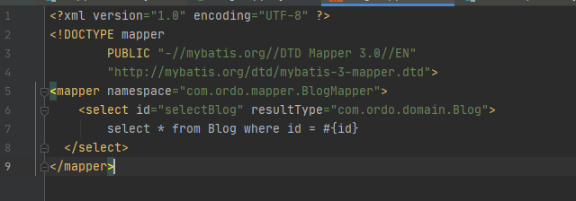

## Mybatis源码

**Mybatis源码结构如下**


### Mybatis接口概览

一、从Session入手：

重要的几个类：

1.Configuration对应xml文件的所有配置项，如数据库连接信息，mapper映射信息，别名， 缓存。对应的get set方法。

2.两个接口 重点 现在不知道什么东西

ResultContext

```java
public interface ResultContext<T> {

  T getResultObject();

  int getResultCount();

  boolean isStopped();

  void stop();

}
```

ResultHandler

```java
public interface ResultHandler<T> {

  void handleResult(ResultContext<? extends T> resultContext);

}
```

3.SqlSession接口及封装的对应异常

SqlSession提供了数据库CURD以及事务相关的方法

Default文件夹中提供了实现类**DefaultSqlSession**


4.SqlSessionFactory接口

工厂模式创建SqlSession 

这个类就做一件事openSession  有多种重载方法

Default文件夹中提供了实现类**DefaultSqlSessionFactory**

其构造方法是

```java
  public DefaultSqlSessionFactory(Configuration configuration) {
    this.configuration = configuration;
  }
```


5.SqlSessionFactoryBuilder

创建SqlSessionFactory  需要接收配置信息。提供了大致两种方式：reader和inputStream

```java
 try {
      XMLConfigBuilder parser = new XMLConfigBuilder(reader, environment, properties);
      return build(parser.parse());
    } 
    
 try {
    XMLConfigBuilder parser = new XMLConfigBuilder(inputStream, environment, properties);
    return build(parser.parse());
    } 

//因此SqlSessionFactoryBuild的作用就是调用XML解析方法，然后返回一个实例化的SqlSessionFactory
  public SqlSessionFactory build(Configuration config) {
    return new DefaultSqlSessionFactory(config);
  }
```

里面的这个XMLConfigBuilder是另一个build包里面的，可见build包主要是做配置信息的解析的


```java
  public Configuration parse() {
    if (parsed) {
      throw new BuilderException("Each XMLConfigBuilder can only be used once.");
    }
    parsed = true;
    parseConfiguration(parser.evalNode("/configuration"));
    return configuration;
  }

```

6.SqlSessionManager


封装了SqlSessionFactory和SqlSession

通过代理实现了CURD和事务回滚  也提供了openSession的方法 


**【疑问】**localSqlSession 的作用

有很多的操作首先要从localSqlSession拿到session

```java
  public void startManagedSession() {
    this.localSqlSession.set(openSession());
  }

  @Override
  public void commit() {
    final SqlSession sqlSession = localSqlSession.get();
    if (sqlSession == null) {
      throw new SqlSessionException("Error:  Cannot commit.  No managed session is started.");
    }
    sqlSession.commit();
  }
```

ThreadLocal的注释里面有这么一句话

```
{@code ThreadLocal} instances are typically private
* static fields in classes that wish to associate state with a thread (e.g.,
* a user ID or Transaction ID).
```


**【疑问】**里面的sqlSessionProxy是通过代理获得的，其中用的类加载器本应该是被代理对象，即SqlSession的类加载器，但却用了Factory的类加载器

代理中的InvocationHandler

```java
private class SqlSessionInterceptor implements InvocationHandler {
    public SqlSessionInterceptor() {
        // Prevent Synthetic Access
    }

    @Override
    public Object invoke(Object proxy, Method method, Object[] args) throws Throwable {
      final SqlSession sqlSession = SqlSessionManager.this.localSqlSession.get();
      if (sqlSession != null) {
        try {
          return method.invoke(sqlSession, args);
        } catch (Throwable t) {
          throw ExceptionUtil.unwrapThrowable(t);
        }
      } else {
        try (SqlSession autoSqlSession = openSession()) {
          try {
            final Object result = method.invoke(autoSqlSession, args);
            autoSqlSession.commit();
            return result;
          } catch (Throwable t) {
            autoSqlSession.rollback();
            throw ExceptionUtil.unwrapThrowable(t);
          }
        }
      }
    }
  }

```

7.TransactionIsolationLevel事务隔离级别

```java
  NONE(Connection.TRANSACTION_NONE),
  READ_COMMITTED(Connection.TRANSACTION_READ_COMMITTED),
  READ_UNCOMMITTED(Connection.TRANSACTION_READ_UNCOMMITTED),
  REPEATABLE_READ(Connection.TRANSACTION_REPEATABLE_READ),
  SERIALIZABLE(Connection.TRANSACTION_SERIALIZABLE);
```


### xml解析过程

**解析的目的是要得到一个Configuration，即需要得到mybatis-config.xml和所有的mappers中的信息**

InputStream流处理xml文件

SqlSessionFactoryBuilder.build(InputStream in)

->XMLconfigBuilder （是BaseBuilder的子类）

```java
  private XMLConfigBuilder(XPathParser parser, String environment, Properties props) {
    super(new Configuration());
    ErrorContext.instance().resource("SQL Mapper Configuration");
    this.configuration.setVariables(props);
    this.parsed = false;
    this.environment = environment;
    this.parser = parser;
  }
```

->XPathParser    want document

->DocumentBuilderFactory

->DocumentBuilder 接口

->DocumentBuilderImpl


Document事实上把xml文件的一个个标签变成一个有层次的节点树List<XNode> 每一个节点存储了其子节点，和本身的信息。将xml信息提取出来最后放在Configuration里面。


```java
public Configuration parse() {
  if (parsed) {
    throw new BuilderException("Each XMLConfigBuilder can only be used once.");
  }
  parsed = true;
  parseConfiguration(parser.evalNode("/configuration"));//根节点
  return configuration;
}
//拿到document的根节点 就可以设置所有的Configuration的属性
private void parseConfiguration(XNode root) {
  try {
    //issue #117 read properties first
    propertiesElement(root.evalNode("properties"));
    Properties settings = settingsAsProperties(root.evalNode("settings"));
    loadCustomVfs(settings);
    loadCustomLogImpl(settings);
    typeAliasesElement(root.evalNode("typeAliases"));
    pluginElement(root.evalNode("plugins"));
    objectFactoryElement(root.evalNode("objectFactory"));
    objectWrapperFactoryElement(root.evalNode("objectWrapperFactory"));
    reflectorFactoryElement(root.evalNode("reflectorFactory"));
    settingsElement(settings);
    // read it after objectFactory and objectWrapperFactory issue #631
    environmentsElement(root.evalNode("environments"));
    databaseIdProviderElement(root.evalNode("databaseIdProvider"));
    typeHandlerElement(root.evalNode("typeHandlers"));
    mapperElement(root.evalNode("mappers"));
  } catch (Exception e) {
    throw new BuilderException("Error parsing SQL Mapper Configuration. Cause: " + e, e);
  }
}
```


继续看Configuration：

那么哪一个属性是存放映射信息的呢？我们注意到Configuration中有一个这个方法。

```java
public <T> void addMapper(Class<T> type) {
    mapperRegistry.addMapper(type);
  }
```

再来看Configuration里面有一个MapperRegistry类

```java
public class MapperRegistry {

  private final Configuration config;
  private final Map<Class<?>, MapperProxyFactory<?>> knownMappers = new HashMap<>();//已经得到的mapper映射

  public MapperRegistry(Configuration config) {
    this.config = config;
  }
    
//实质上是一个Map
    public <T> void addMapper(Class<T> type) {
        if (type.isInterface()) {
            if (hasMapper(type)) {
                throw new BindingException("Type " + type + " is already known to the MapperRegistry.");
            }
            boolean loadCompleted = false;
            try {
                knownMappers.put(type, new MapperProxyFactory<>(type));//生成代理并组成key-value放进map中
                // It's important that the type is added before the parser is run
                // otherwise the binding may automatically be attempted by the
                // mapper parser. If the type is already known, it won't try.
                MapperAnnotationBuilder parser = new MapperAnnotationBuilder(config, type);
                parser.parse();
                loadCompleted = true;
            } finally {
                if (!loadCompleted) {
                    knownMappers.remove(type);
                }
            }
        }
    }
    //取mapper
    public <T> T getMapper(Class<T> type, SqlSession sqlSession) {
        final MapperProxyFactory<T> mapperProxyFactory = (MapperProxyFactory<T>) knownMappers.get(type);
        if (mapperProxyFactory == null) {
            throw new BindingException("Type " + type + " is not known to the MapperRegistry.");
        }
        try {
            return mapperProxyFactory.newInstance(sqlSession);
        } catch (Exception e) {
            throw new BindingException("Error getting mapper instance. Cause: " + e, e);
        }
    }
```

看一下DefaultSqlSession中的getMapper  

```java
@Override
public <T> T getMapper(Class<T> type) {
  return configuration.getMapper(type, this);//与上面对应
}
```

我们可以看到添加mapper用的是HashMap, 如果未来需要对大量Mapper操作引入多线程，就可以改成ConcurrentHashMap

#### MapperStatement生成逻辑




原理： 读取xml  构建xml到mapper之间的映射关系   返回值和jdbcType的映射关系   

```java
   configuration.addMapper(BlogMapper.class);
```

通过BlogMapper的全类名还可以找到对应的xml


### Mapper实例生成原理

```java
 SqlSession session = sqlSessionFactory.openSession();
```


这就是sqlSession 

由SqlSessionFactory创建。追进去看到了事务， 默认jdbc事务工厂创建 ，还有执行器默认使用的是缓存实现。


sqlSession怎么生成实例的呢？

```java
  BlogMapper blogMapper = session.getMapper(BlogMapper.class);
```

session的实现类DefaultSqlSession返回实例： T泛型就是BlogMapper.class

源码追踪：

```java
  //1.DefaultSqlSession
  @Override
  public <T> T getMapper(Class<T> type) {
    return configuration.getMapper(type, this);
  }

//2.Configuration
  public <T> T getMapper(Class<T> type, SqlSession sqlSession) {
    return mapperRegistry.getMapper(type, sqlSession);
  }
//3.MapperRegistry
//用一个map记录已经映射的mapper: knownMappers 对应一个mapper代理生产工厂
  private final Map<Class<?>, MapperProxyFactory<?>> knownMappers = new HashMap<>();

  public <T> T getMapper(Class<T> type, SqlSession sqlSession) {
    final MapperProxyFactory<T> mapperProxyFactory = (MapperProxyFactory<T>) knownMappers.get(type);
    if (mapperProxyFactory == null) {
      throw new BindingException("Type " + type + " is not known to the MapperRegistry.");
    }
    try {
        //返回一个mapperProxy
      return mapperProxyFactory.(sqlSession);
    } catch (Exception e) {
      throw new BindingException("Error getting mapper instance. Cause: " + e, e);
    }
  }
//4.mapperProxyFactory
  public T newInstance(SqlSession sqlSession) {
    final MapperProxy<T> mapperProxy = new MapperProxy<>(sqlSession, mapperInterface, methodCache);
    return newInstance(mapperProxy);
  }

//5.生成代理！
  protected T newInstance(MapperProxy<T> mapperProxy) {
    return (T) Proxy.newProxyInstance(mapperInterface.getClassLoader(), new Class[] { mapperInterface }, mapperProxy);
  }


```

MethodCache就是mapper中所有的方法的缓存。

MapperProxy实际上是一个包装，对应的就是BlogMapper.class和BlogMapper.xml


对方法进行缓存 method ， methodInvoker

methodInvoker就是一个代理 代理执行invoke方法

```java
    public Object invoke(Object proxy, Method method, Object[] args, SqlSession sqlSession) throws Throwable {
      return mapperMethod.execute(sqlSession, args);
    }
```


**MapperMethod**也是是一个封装 对MapperProxy中的方法进行封装 

封装了两个东西 一个是**sqlCommand** 还有一个方法签名**MethodSignature** 一一对应

这两个是用来描述一个mapper方法的 sqlCommand和方法签名与mapper接口对应 涵盖了如返回值 参数列表等信息


**至此，Mapper实例化为了MapperProxy**

而其中的接口和sql语句又可以通过**MapperMethod**增强以及执行。


### Mapper的执行

现在已经有的是解析后的xml文件 事务，接下来是缓存和jdbc交互。

MapperMethod具体又是怎么执行的的呢？---->里面的execute方法

**调用SqlSession去执行**

首先参数准备

```java
    public Object convertArgsToSqlCommandParam(Object[] args) {
      return paramNameResolver.getNamedParams(args);
    }
```


【思考】这里可以看到mybatis的可扩展性不是很好 MapperMethod是一个实现， 没有面向接口编程或者模板方法

然后走DefaultSqlSession


这里也有一个很有意思的封装类**MappedStatement**, 封装了**一个操作**也就是statement需要的所有信息，如返回值，参数列表，Configuration等等。


SqlSession封装了一个Executor，SqlSession再去委托执行器。Executor是一个接口 有若干实现如SimpleExecutor，CacheExecutor等等  


**BoundSql是sql的封装类**


也封装了需要的参数列表，不过是在后面才将参数注入，因为要过缓存，如果缓存中有结果，就不需要查数据库，也没必要注入sql了。

【补充】jdbc中的statement分三种

**StatementType  STATEMENT, PREPARED, CALLABLE** 

不带参数的sql语句  preparedStatement带参数的sql语句防止sql注入  callable用于存储过程

executor没看见delete select 由于做了封装

update包含了增删改 对数据库的更新 query就是查 对应select


#### Mybatis一级缓存

就在于这里


```java
CacheKey key = createCacheKey(ms, parameterObject, rowBounds, boundSql);//为了缓存一个操作的结果
```


追溯localCache 在PerpetualCache类里面封装了一个Map，key就是上图中计算出来的Cachekey实例，可以按照一个特殊字符串来理解，它确保了正在执行的mapper方法的唯一性，而value值就是一个对应的结果集。


先试图从缓存中取值，赋给list 若list为空 再从数据库中查询 

在数据库查询时顺便加缓存 localCache  **先put一个占位符 然后放结果**

```java
localCache.putObject(key, list);
```


#### 查询数据库并执行Statement

查询数据库：中间调用的doQuery又是SimpleExecutor


**先跳出具体步骤，整体看这个结构：**

这里的操作就跟原生jdbc非常相似

看那熟悉的try-catch 我虎躯一震  查完之后statement先关；

实际的操作是由这里的 **StatementHandler**完成的，**之前的操作可以理解为一个是过缓存的过程**

验证一看 最后的close操作就是把jdk中的封装了一下。

```java
      StatementHandler handler = configuration.newStatementHandler(wrapper, ms, parameter, rowBounds, resultHandler, boundSql);
      stmt = prepareStatement(handler, ms.getStatementLog());
      return handler.query(stmt, resultHandler);

```


**继续看实现**

具体实现jdbc交互需要获取连接，sql注入，这一部分的工作交给了simpleExecutor完成，就是上面的prepareStatement方法。

这里就联系到了非常重要的接口 **StatementHandler**

事务拿到Connection。最后也由事务关闭Connection  **事务负责一个操作的生命周期**  事务在Executor中封装的

调试时跳转到了jdbcTransaction


从MysqlDatabase中获取连接，可以看到还有事务的隔离级别的设置。

【补充】

https://www.cnblogs.com/wyaokai/p/10921323.html 这里有事务相关知识的总结


获取连接之后 statementHandler就开始干活了， 它也有若干个实现。

也是装饰者模式的使用，与上面的executor如出一辙。


**接着上面的connection，继续**

一、handler对statement在prepare方法中做了一些初始化操作


ErrorContext就是提供错误日志的类

try-catch中对新建的statement进行初始化。

二、参数注入

```java
 handler.parameterize(stmt);
```

由PrepareStatementHandler完成这部分工作：


是一通return回到Executor：


现在深刻理解了为啥叫**StatementHandler**了...

statement在executor中被初始化，而handler接口就是对statement进行**获取和加工赋值以及执行**， 最后由SimpleExecutor关闭statement。

这里可以总结看一看handle至此做了哪些操作：

1.获取连接 事务干活

2.准备statement  并preparedStatement进行参数赋值  说白了就是进行sql的动态拼接

3.返回处理好的statement


然后交给另外一个RoutingStatementHandler实现类去执行


中间有一大坨复杂的实现 暂时跳过


#### 结果集映射

结果集映射 所有的结果集都先用List<Object>封装


结果集映射的原理：

分两块：

1.xml里面的配置resultType xml中还可以配置构造属性 结果集 

2.ResultType返回的数据的原信息 包装

然后把以上两者关联组装起来。

返回结果 结束


MetaObject这块用的都是一堆反射 从resultsetWrapper生成结果。


这里有个大神的博客把结果集映射讲的比较透彻

https://www.cnblogs.com/qm-article/p/10658527.html

#### 补充

【上下文】生命周期内产生的变量

【补充】连接池的实现 数组 归还


【补充】这里调试的时候发现 存在Base Cache SimpleExcutor的左右横跳  这三者都来源于Executor 分别做了对应的增强-->**装饰者模式**

**代理模式和装饰者模式的区别**

代理模式有控制 但装饰着没有

【补充】

PrepareStatement接口中有三个方法

```java
//DML
ResultSet executeQuery() throws SQLException;
//DDL
int executeUpdate() throws SQLException;

//如果是一个结果集就是true 否则false 对应上面两种返回结果
@return <code>true</code> if the first result is a <code>ResultSet</code>
     *         object; <code>false</code> if the first result is an update
     *         count or there is no result
boolean execute() throws SQLException;
```

可以通过调execute，返回的Boolean指向结果集或者影响数据库的行数

DDL DML语言 数据库的定义语言和操作语言 前者是建表建库 后面是增删改查


【神奇操作】绕过构造器得到一个类的实例

Unsafe使用


